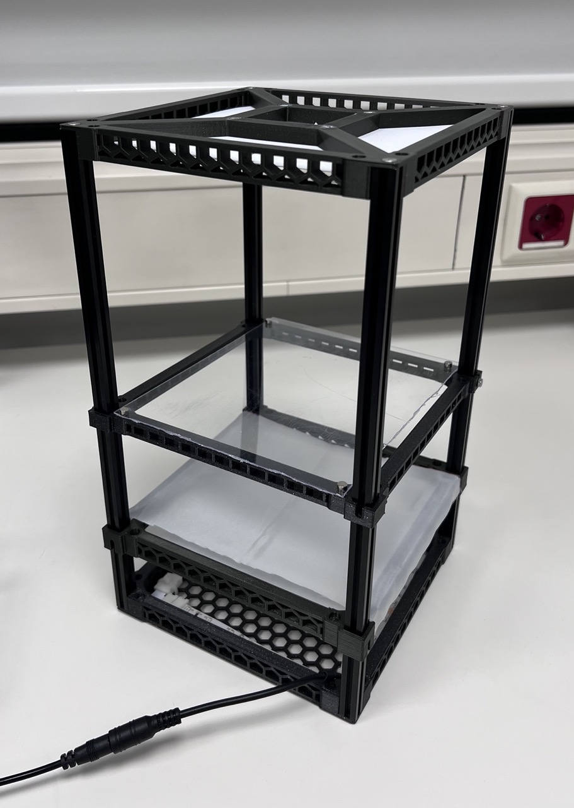

# Assembly Guide

## Introduction

::: {style="float: right; width: 28%; margin-left: 1em;"}

:::

The AniScope is a modular, 3D-printed imaging arena for tracking small animals (insects, spiders, larvae, etc.). It provides uniform infrared backlighting, adjustable diffusion, and a stable camera mount—all in a compact, customisable package.

**Difficulty:** Beginner–Intermediate  
**Build time:** 1-2 hours (excluding 3D printing)  
**3D printing time:** Approximately 20 hours (varies by printer)  
**Estimated cost:** €XX–€XX (excluding camera and 3D printer)

> **Before you start:** Read each section to the end before beginning it. This helps you understand what's coming and ensures you have everything ready. Printing the 3D parts may take a couple of days on a single printer—plan accordingly.


## Bill of Materials

Gather all of the following before you begin. Links are provided for reference; equivalent parts from other suppliers will work.

```{r}
#| echo: false
library(gt)

tibble::tribble(
  ~Category, ~Item, ~Quantity, ~Source, ~Price, ~Notes,
  
  # 3D Printing
  "3D Printing", "3D printer", "1", NA, NA, "Any FDM printer with ≥15 cm build plate",
  "3D Printing", "PLA/PETG filament", "~Xg", NA, NA, "Colour of your choice",
  
  # Structural Components
  "Structural Components", "MakerBeam 30 cm", "4", "[Link](#)", "€X", NA,
  "Structural Components", "MakerBeam tapered bolts", "4", "[Link](#)", "€X", NA,
  "Structural Components", "MakerBeam standard bolts", "8", "[Link](#)", "€X", NA,
  "Structural Components", "MakerBeam nuts", "X", "[Link](#)", "€X", NA,
  
  # Lighting
  "Lighting", "IR LED strip", "1 roll", NA, NA, "850 nm or 940 nm; need 40 cm total",
  "Lighting", "End click connector", "1", NA, NA, "Must match strip width",
  "Lighting", "Corner click connectors", "3", NA, NA, "Must match strip width",
  "Lighting", "12V power supply", "1", NA, NA, "For LED strips",
  
  # Assembly Supplies
  "Assembly Supplies", "Neodymium magnets (Ø6 x 2 mm)", "X", NA, NA, "Quantity depends on configuration",
  "Assembly Supplies", "Superglue (cyanoacrylate)", "1", NA, NA, "Gorilla Glue or similar",
  "Assembly Supplies", "Diffuser fabric", "1 piece", NA, NA, "White ripstop nylon or similar; ~20 x 15 cm",
  "Assembly Supplies", "Small cable ties", "~10", NA, NA, "For cable management",
  "Assembly Supplies", "Disposable gloves", "1 pair", NA, NA, "Nitrile or latex",
  "Assembly Supplies", "Paper towels", "A few sheets", NA, NA, "For wiping excess glue",
  "Assembly Supplies", "Stanley knife / scissors", "1", NA, NA, "For cutting LED strips and fabric"
) |>
  gt(groupname_col = "Category") |>
  fmt_markdown(columns = c(Item, Source)) |>
  sub_missing(missing_text = "") |>
  cols_label(
    Item = "Item",
    Quantity = "Quantity",
    Source = "Source",
    Price = "Approx. Price",
    Notes = "Notes"
  ) |>
  tab_style(
    style = list(
      cell_fill(color = "#f5f5f5"),
      cell_text(weight = "bold")
    ),
    locations = cells_row_groups()
  ) |>
  tab_style(
    style = cell_borders(sides = "bottom", color = "#d3d3d3", weight = px(1)),
    locations = cells_body()
  ) |>
  tab_options(
    table.width = pct(100),
    row_group.padding = px(10)
  )
```

## 3D Printing

Print the following parts. STL files are available at [link].

| Part | Quantity | Infill | Supports | Print Time |
|------|----------|--------|----------|------------|
| Bottom piece (with grid) | 1 | 20% | No | ~X hrs |
| Top piece | 1 | 20% | No | ~5 hrs |
| Top piece, empty | 1 | 15% | No | ~5 hrs |
| Diffuser frame | 1 | 20% | No | ~X hrs |
| Camera mount (optional) | 1 | 30% | Yes | ~X hrs |

**Choosing a top piece:**

- **Open top (no centre):** Best for DSLR on a tripod or other external mount
- **X-mount top:** Best for USB cameras with a dedicated camera attachment

**Optional but recommended:** Print the [magnet insertion handles](link-to-file)—they make magnet installation much easier.

Print settings:

- Nozzle: 0.4
- Layer height: 0.2 mm
- No skirt (0 mm)
- Brim: 3 mm

::: {layout-ncol=2}

:::: {#fig-camera-adapter}
Camera mount

<iframe src="https://render.githubusercontent.com/view/solid?url=https://raw.githubusercontent.com/roaldarbol/AniScope/v2/examples/01_groundbeetles/adapter_camera_usb.stl" width="100%" height="300" frameborder="0"></iframe>
::::

:::: {#fig-camera-adapter-2}
Camera mount 2
<iframe src="https://render.githubusercontent.com/view/solid?url=https://raw.githubusercontent.com/roaldarbol/AniScope/v2/examples/01_groundbeetles/adapter_camera_usb.stl" width="100%" height="300" frameborder="0"></iframe>
::::

:::

## Assembly

### Step 1: Attach Magnets to the Bottom Piece

> **Warning:** Superglue bonds skin instantly. Wear gloves throughout this step, and have paper towels within reach to wipe up excess glue immediately.

> **Read this entire step before starting.** Once glue is applied, you have only a few seconds to position the magnet.

#### Decide on magnet polarity

All magnets in **upward-facing holes** should have the same pole facing up. All magnets in **downward-facing holes** should have the opposite pole facing up. This ensures parts attach correctly later. The [**Magic Magnet Tool**](https://www.printables.com/model/442051-the-magic-magnet-tool-small-size) makes this easy by providing a tool for each.

#### Install each magnet

1. Place a magnet on the insertion tool (or hold carefully with gloved fingers), correct pole facing outward.
2. Apply a small drop of superglue into the hole.
3. Press the magnet firmly into the hole.
4. If using the tool, slide it sideways while holding the magnet in place with your other hand.
5. Immediately wipe away any excess glue with paper towel.
6. Repeat for all required holes.

**Wait at least 5 minutes** before bringing other magnets near—the glue needs time to cure, and magnetic attraction can pull magnets out of wet glue.


**Checkpoint:** Magnets should sit flush with or slightly below the surface. Test with a loose magnet—it should snap firmly into place from ~1 cm away.

### Step 2: Attach Magnets to the Diffuser Frame

1. Orient the diffuser frame so the **corner grooves face upward**.
2. Flip it over—you'll attach magnets to the **bottom** (the side now facing up).
3. Install magnets in the four corner holes using the same technique as Step 1.
4. Ensure polarity is correct: these magnets must attract the bottom piece's magnets.

**Checkpoint:** Place the diffuser frame on the bottom piece. It should click into place magnetically and sit flat.

### Step 3: Prepare the LED Strips

> **Warning:** When stripping waterproof strips, remove only the silicone coating, ensuring not to cut the strip itself.

> **Warning:** Do not lift the metal contacts inside the click connectors. This causes loose connections that are difficult to fix.

1. Cut **4 segments** from the LED strip roll, each **2 LEDs long** (~10 cm). Cut only on the marked lines.
2. If using waterproof strips: carefully trim ~1 cm of silicone coating from each end to expose the contacts.
3. Open a **corner connector** by lifting the plastic flaps.
4. Insert one strip, matching **+** to **+** and **−** to **−**.
5. Close the flap firmly.
6. Repeat, connecting all four strips with three corner connectors to form a square.
7. Attach the **end connector** to one remaining strip end for power.
8. Place the **LED strip assembly** into the bottom piece's floor. 
9. Use small cable ties to secure across the connectors and in the middle of each segment.


**Checkpoint:** Connect to 12V power briefly. All four strips should illuminate evenly - this may not be visible by eye, instead point an IR-sensitive camera at the strips to see whether they light up. If any strip is dim or off, check that connector's contacts.

**Set the LED assembly aside**—we'll install it into the frame later.

### Step 4: Prepare the Diffuser Fabric

1. Cut a piece of diffuser fabric approximately **20 cm × 15 cm** (exact size is not critical; it just needs to cover the frame with ~2 cm overhang on each side).
2. Place the diffuser frame groove-side up.
3. Lay the fabric over the top.
4. On one short end, fold the fabric underneath and secure with **2 spare magnets** on the underside.
5. Pull the fabric taut across the top.
6. Fold the opposite end underneath and secure with 2 more magnets.

**Checkpoint:** The fabric should be taut with no wrinkles. When held up to light, it should appear evenly translucent.

### Step 5: Assemble the Frame

1. Take the **4 MakerBeam 30 cm rails** and **4 tapered bolts**.
2. Screw a tapered bolt into each corner hole of the **bottom piece**. The rails should point upward.
3. Slide the **diffuser frame** down the rails from above.
4. On the sides with grooves, slide a **standard bolt** into the MakerBeam slot.
5. Adjust the diffuser to your desired height, then tighten the bolt with a nut to lock it in place.
6. (Optional) If using multiple diffusers, add them the same way at different heights.
7. Slide the **arena** down the rails and secure at the desired height.
8. Attach the **top piece** to the rail tops using the remaining tapered bolts.


### Step 6: Attach the Camera (Optional)

If using a **USB camera** with the X-mount top:

1. Attach the camera to the printed camera mount.
2. Slide the mount into the X-shaped slot on the top piece.
3. Secure with magnets or bolts as appropriate for your mount design.

If using a **DSLR or external camera:**

1. Position your tripod over the AniScope, looking down through the open top.
2. Adjust tripod height so the arena fills the camera's field of view.

### Step 7: Connect Power and Test

1. Connect the LED strip's power cable to your 12V supply.
2. Power on and verify all LEDs illuminate.
3. If using IR LEDs, you can verify operation with an IR camera (most cameras cannot see near-IR light).

## Final Checklist

- [ ] All magnets secure and properly polarised
- [ ] LED strips illuminate evenly
- [ ] Diffuser fabric taut and wrinkle-free
- [ ] All frame components slide smoothly on rails
- [ ] Camera has clear view of entire arena
- [ ] No loose cables in the imaging area

**Congratulations—your AniScope is ready to use!**


## Notes and Tips

- **More diffusion needed?** Add a second diffuser layer, or use a second diffuser frame with fabric at a different height.
- **Custom arena sizes:** The design is parametric—see [link] to generate parts for different dimensions.
- **Filament choice:** PLA works fine for most uses. PETG is more durable if you expect rough handling.